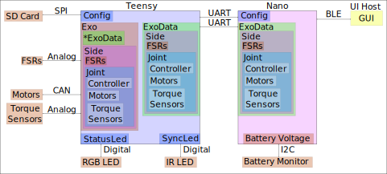
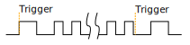

# User Guide

## Outline
1.  [Background](#background)
1.  [Introduction](#introduction)
    1. [Code location](#code-location)
    2. [Style Guide](#style-guide)
    3. [System Structure](#system-structure)
    4. [How to Deploy](#how-to-deploy)
2.  [High level functionality](#high-level-functionality)
    1. [Code Structure](#code-structure)
    2. [Guiding Principles](#guiding-principals)
    3. [Operation](#operation)
3.  [SD Card](#sd-card)
    1. [SD Configuration](#sd-configuration)
    2. [SD Controller Parameters](#sd-controller-parameters)
3.  [Sensors](#sensors)
    1. [Sensor Structure](#sensor-structure)
    2. [Adding New Sensors](#adding-new-sensors)
3.  [Displays](#displays)
    1. [Status LED](#status-led)
    2. [Sync LED](#sync-led)
4.  [Actuators](#actuators)
    1. [Actuator Structure](#actuator-structure)
    2. [Adding New Actuators](#adding-new-actuators)
    3. [T-motor Initialization](#t-motor-initialization) (Get info from Chance)
5.  [Controllers](#controllers)
    1. [Controller Structure](#controller-structure)
    2. [Adding New Controllers](#adding-new-controllers)
    3. [Controller Parameters](#controller-parameters)
6. [Bluetooth Communication](#bluetooth) (Get info from Chance)
    1. [Bluetooth Background](#bluetooth-background)
    2. [Bluetooth Structure](#bluetooth-structure)
    3. [Sending a Message](#sending-a-message)
7. [Debugging](#debug)
8. [Adding New](#adding-new)
    1. [Adding New Board](#adding-new-board)
    2. [Adding New Microcontroller](#adding-new-microcontroller)
    3. [Adding New Item To Config](#adding-new-item-to-config)
8. [Resources](#resources)
    1. [Lab Resources](#lab-resources)
    1. [C++ Resources](#c-resources)
    1. [Bluetooth Resources](#bluetooth-resources)
9. [Known Issues](#known-issues) 
**

## Background
The code is written in Arduino and C++.
This background section is intended to give you and understanding about the different things you may see in the code and how to interpret them.
More detailed information can be found on the internet, [tutorialspoint](https://www.tutorialspoint.com/cplusplus/index.htm) and [w3schools](https://www.w3schools.com/cpp/default.asp) are good but there are other resources that are as well.

### Bits and Bytes
A bit is the smallest unit of information that a computer can work with and store. It is represented by one of two states, either a 0 or a 1.

Bytes are composed of 8 bits and are typically the units used on a computer as a single bit is usually too small. One byte is usually capable of holding information for one character (e.g., 'D', 'o', 'g', '!') whereas 4 or 8 bytes are usually used to store intergers (e.g., 1, 4, 6, 8).

#### Bitwise Operators
& - bitwise AND; takes two bytes and performs AND on every bit. Will result in a 1 only if both bits are 1.

| - bitwise OR; takes two bytes and performs OR on every bit. Will result in a 1 if either of the two bits is a 1. 

**ex.** Simple Example
```
V0: 	0b10101010
V1: 	0b11110000
-------------------
V0 & V1:0b10100000
V0 | V1:0b11111010
```

#### Bit Shifting
Bit Shifting, as its name implies, moves the binary value of the bit of interest some determined number of places to the left or right. 
This is traditionally used for data storage purposes. For example, if you have a boolien (see section below) that will either have a 0 or a 1 it would be inefficient to store only that in a single byte. 
Thus, we can use bit shifting to store multiple booliens (e.g., 8) into a single byte, which is much more efficient. 

**ex.** [Utilities.cpp](/ExoCode/src/Utilities.cpp)
```
uint8_t update_bit(uint8_t original, bool val, uint8_t loc)
{
    uint8_t keep_bit = ~(1<<loc);  //set a mask for the bits we aren't setting 
    
    return (original & keep_bit) | (val<<loc);
};
```
1. This shifts a 1 into the loc position, so if loc is 2 it shifts the 1 two positions to the left 0b00000001<<2 becomes 0b00000100.
2. Then the ~ inverts the bits to: 0b11111011
3. Move the val to the current position val<<loc, for our 2 example this would put a 1 or 0 in the 2nd position with zeros for everything else.
4. original & keep_bit, keep_bit is the value from step 1, when added with the original it will return the original but with a 0 in the loc position
5. Or the values from 3 and 4, which will return the original with the bit in the loc position set to whatever was in val.

### Addresses
Data on the microcontroller are stored in a loctaion. The address represents the location that said data is stored. An example of what an address looks like would be: 0x7ffcccc2f420

### Variables
Variables are used as a means to store data/information. Variables have a name that pertains to its identity and helps distinguish it from other pieces of data/information.
When creating a variable you must declare (specify) its type. Information on types can be found in the section below.

**Syntax:** type variable_name = value;


**ex.** [BleMessage.h](/ExoCode/src/BleMessage.h)

```
// Number of parameters to expect with the command
int expecting = 0;
``` 

### Types
Data types specify the type of information that can be stored as well as the size of the information that can be stored. The types encountered in our code are as follows:

#### Bool
The Bool (Boolean) type can store true (1) or false (0) values.

**ex.** [ExoCode.ino](/ExoCode/ExoCode.ino)
```
static bool first_run = true;
```
This variable stores if it is the first run of the loop().
If it is we do some startup stuff, then change it to false.
A bool is still stored in a byte so it doesn't save a ton of room unless you pack a bunch of them into another type.

##### Logical Operators
&& - Logical AND; Returns "true" if both statements are true.

|| - Logical OR; Returns "true" if at least one statement is true.

!  - Logical NOT; Changes the result to its opposite (e.g., would display false if the result was true)

**ex.** Simple Example
```
bool dogs_are_cute = true;
bool cats_are_nice = false;
bool dogs_bark = true;

cout << dogs_are_cute && dogs_bark;  		//Would output true
cout << dogs_are_cute && cats_are_nice; 	//Would output false

cout << dogs_are_cute || cats_are_nice;		//Would output true

cout << !(dogs_are_cute && cats_are_nice);	//Would output true
```

#### Char
The Char type can store one character. The character should be surrounded by single quotes (e.g., 'P','u','p','p','y').

**ex.** [BleMessage.h](/ExoCode/src/BleMessage.h)
```
// GUI command
char command = 0;
```

#### Int
The int type is used when storing numbers without a decimal. 

**ex.** [BleMessage.h](/ExoCode/src/BleMessage.h)
```
// Number of parameters to expect with the command
int expecting = 0;
```

#### Float
The float type is used when storing numbers that have a decimal. It is capable of occupying 32 bits which is approximately 7 decimal places.

**ex.** [TorqueSensor.h](/ExoCode/src/TorqueSensor.h)
```
float _calibrated_reading;
```

#### Double
A double also stores numbers that have a decimal place but has double the precision of the float (hence the name). That is, it can occupy 64 bits which is approximately 15 decimal places. 

**ex.** We don't really use doubles but it is here for completeness.

#### Arrays
Arrays are used to store several values witin one variable. Similar to other variables, arrays need a data type (e.g., int, bool, float...). 
Each value in the array is called an element which has its own index (place within the array). It should be noted that the indexing starts at 0 rather than 1. So to access the first element in the array you would use index 0.

**Syntax:** type name[number_of_elements] = {element1, element2, ....};

**ex.** Simple Example

```
int numbers [6] = {10, 20, 30, 40, 50, 60};

cout << numbers[0];	//Would output 10
cout << numbers[1];	//Would output 20
```

**ex.** [ExoCode.ino](/ExoCode/ExoCode.ino)
```
uint8_t (config_to_send)[ini_config::number_of_keys];
```

#### Void
Void means that there is no type, thus variables cannot be defined with "void".
The primary utilization of void is for functions that return no values (more on those later).

**ex.** [SyncLed.cpp](/ExoCode/src/SyncLed.cpp)
```
/*
* Sets the flags to start or stop the blink sequence
*/
void SyncLed::trigger()
{
	_do_start_stop_sequence = _do_start_stop_sequence ^ true;  // xor with one to change boolean state
	_do_blink = _do_blink ^ true;  // xor with one to change boolean state
	_state_change_count = 0;  // reset the state change count.
};
```

#### Typecasting
Typecasting converts a variable of one type into a different type. There are two types of typecasting: Implicit and Explicit.

Implicit typecasting occurs when the compiler automatically converts one data type to another without explicit programmer intervention.

**ex.** Implicit Typecasting - Simple Example
```
int value = 40;
char letter = 'd';

int result = value + letter;

cout << result; //Prints out the value of result, which is 140
```

Explicit typecasting occurs when the programmer manually changes a variable from one data type to another. Format: (new type) variable;

**ex.** Explicit Typecasting - Simple Example
```
int value;
value = (int)12.2333;

cout << value; //Prints out the value, which is 12
```

**ex.** [Utilities.h](/ExoCode/src/Utilities.h)
```
val.i = (short int) (num_to_convert * factor);
```

#### Modifiers
Modifiers are used to alter the meaning of varilabe types (e.g., int, double, char) in order to better match the requirements of different circumstances.
There are 4 type modifiers in C++: Signed, Unsigned, Long, Short. It should be noted that you can use combination of modifyers (e.g., unsigned long int)

##### Signed vs Unsigned
Signed and unsigned modifiers can only be used with int and char data types.

Signed variables are capable of storing postitive and negative values as well as zero. The type int by defult is signed. (Signed Int Value Range: -2,147,483,648 to 2,147,483,647)

Unsigned variables are only capable of storing postive values and zero. These can never be negative. (Unsigned Int Value Range: 0 to 4,294,967,295)

Signed variables use one extra bit to account for the sign of the value (compared to unsigned), hence unsigned can be used to save extra space. 

**ex.** [BleParser.cpp](/ExoCode/src/BleParser.cpp)
```
//Get the amount of characters to wait for
for(unsigned int i=0; i < sizeof(ble::commands)/sizeof(ble::commands[0]); i++)
{
```

##### Long and Short
The long modifier modifies the maximum value that a data type can hold. Long can be used for int and double data types. Long modifiers can be used twice (int only) to create larger numbers (e.g., long long int). 

The short modifier modifies the minimum value that a data type can hold. Short can be used for int.

The primary value of using these modifiers is for memory usage purposes. A short int will use less bytes than an int whereas a long int will use more bytes than an int. 

**ex.** [Utilities.h](/ExoCode/src/Utilities.h)
```
val.i = (short int) (num_to_convert * factor);
```

##### Static
A static variable means that the variable is created at the start of the program and destroyed at the end of the program. This allows the variable to maintain its value even after going beyond its scope.

Scope helps determine where the variable can be accessed within the code. There are generally two types: Local and Global. 

Local Scope: variables can only be accessed within the block of code that they are declared. 

Global Scope: variables can be access from the time of declaration within the code until the end of the code. 

**ex.** [ExoCode.ino](/ExoCode/ExoCode.ino)
```
static bool first_run = true;
```

##### Volatile
A volatile variable means that the value may change between accesses to the variable, even if said variable appears unmodified. The use of volatile guarantees that the varilabe will be read again before any usage. 
This may be useful in a situation when a controller may try to use a previous copy of the variable value (that it assumes are unchanged) rather than reading and writing using the current value. 
This is common in situations when the variable value can change due to something outside of the code (e.g., hardware that changes the value).

**ex.** [SyncLed.h](/ExoCode/src/SyncLed.h)
```
volatile int _current_sync_period; // The current period to use.  Whenever syncLedHandler is called the interupt should have another begin call to make sure the period is correct.
```

##### Extern

Extern is useful when using multiple modules. You can define a variable in one .cpp file and then use that variable in another .cpp file without defining it.

**ex.** Simple Example

FileOne.cpp

```
int variable = 20;
```

FileTwo.cpp
```
extern int variable;
cout << variable; //This would output 20
```

**ex.** [SPIHandler.h](/ExoCode/src/SPIHandler.h)
```
extern uint8_t is_ff[num_bytes];
```

### Conditions
Expressions within the code that will be either true or false. 
Typically the outcome of these conditions will determine how/if certain sections of code are run.

#### If-Else Statments
If statements specify a section of code that will run if the condition is evaluated as true.
Else statments specify a section of code that will run if the condition is evaluated as false. Else statments are not required (that is, you do not need to have a section of code that runs if the condition is evaluated as false).
It is possible to have multiple conditions, in which case we can use "else if" statements as part of the evaluation. 

**Syntax:**
```
if (condition_one)
{
	//Code to run if true
}
else if (condition_two)
{
	//Code to run if true
}
else
{
	//Code to run 
}
```

**ex.** Simple Example
```
int x = 20;
int y = 42;

if (x < y)
{
	cout << "The dog is really really good.";
}
else if (x > y)
{
	cout << "The dog is really good."
}
else
{
	cout << "The dog is good."
}
```

There is an alternative way to formulate if-else statments within the code that signficantly reduces the amount of space used by these statments.
Note that this only works if there is one condition to be evaluated (does not work for "else if").
This formulation is commonly used throughout our code. 

**Syntax:** variable = (condition) ? if_true : if_false;

**ex.** Simple Example
```
int x = 20;
int y = 42;

string result = (x < y) ? "The dog is really really good." : "The dog is really good."
cout << result;
```

**ex.** [Controller.cpp](/ExoCode/src/Controller.cpp)
```
float ZeroTorque::calc_motor_cmd()
{
    float cmd_ff = 0;
    
    // add the PID contribution to the feed forward command
    float cmd = cmd_ff + (_controller_data->parameters[controller_defs::zero_torque::use_pid_idx] 
                ? _pid(cmd_ff, _joint_data->torque_reading,_controller_data->parameters[controller_defs::zero_torque::p_gain_idx], _controller_data->parameters[controller_defs::zero_torque::i_gain_idx], _controller_data->parameters[controller_defs::zero_torque::d_gain_idx]) 
                : 0);
   
    return cmd;
};
```

In the above example, the condition being evaluated is whether or not we are using PID control and if it is true then it augments the feed forward command appropriately. 

#### Switch Statements
Switch statements are valuable when there are several different blocks of code that could be run depending on if an expression is true.

**Syntax:**
```
switch(expression)
{
	case x:
		//Code to be run
	   break;
	case y:
		//Code to be run
	   break;
	case z:
		//Code to be run
	   break;
	default:
		//Code to be run
}
```

If the expression matches the case value (x, y, z in the above syntax), then the block of code for that case runs. 
The code will run until it reaches the "break" keyword, this is useful as this will cause the code to skip the rest of the switch blocks which can save considerable time. 
In some instances it is useful to have a section of code that runs if the expression does not match any of the cases. This is where the "default" keyword comes into use. 
Importantly, this default must be the last statment used (no break is required). Also note that the expression used in these statments must be of type int or enum.

**ex.** Simple Example
```
int month = 5;

switch (month)
{
	case 1:
		cout << "January";
	   break;
	case 2:
		cout << "February";
	   break;
	case 3:
		cout << "March";
	   break;
	case 4:
		cout << "April";
	   break;
	case 5:
		cout << "May";
	   break;
	case 6:
		cout << "June";
	   break;
	case 7:
		cout << "July";
	   break;
	case 8:
		cout << "August";
	   break;
	case 9:
		cout << "September";
	   break;
	case 10:
		cout << "October";
	   break;
	case 11:
		cout << "November";
	   break;
	case 12:
		cout << "December";
	   break;
	default:
		cout << "This is not a month.";
}

```

**ex.** [Controller.cpp](/ExoCode/src/Controller.cpp)
```
 switch (utils::get_joint_type(_id))
    {
        case (uint8_t)config_defs::joint_id::hip:
            #ifdef CONTROLLER_DEBUG
                logger::print("HIP ");
            #endif
            if (is_left)
            {
                _controller_data = &(exo_data->left_side.hip.controller);
                _joint_data = &(exo_data->left_side.hip);
            }
            else
            {
                _controller_data = &(exo_data->right_side.hip.controller);
                _joint_data = &(exo_data->right_side.hip);
            }
            break;
            
        case (uint8_t)config_defs::joint_id::knee:
            #ifdef CONTROLLER_DEBUG
                logger::print("KNEE ");
            #endif
            if (is_left)
            {
                _controller_data = &(exo_data->left_side.knee.controller);
                _joint_data = &(exo_data->left_side.knee);
            }
            else
            {
                _controller_data = &(exo_data->right_side.knee.controller);
                _joint_data = &(exo_data->right_side.knee);
            }
            break;
        
        case (uint8_t)config_defs::joint_id::ankle:
            #ifdef CONTROLLER_DEBUG
                logger::print("ANKLE ");
            #endif
            if (is_left)
            {
                _controller_data = &(exo_data->left_side.ankle.controller);
                _joint_data = &(exo_data->left_side.ankle);
            }
            else
            {
                _controller_data = &(exo_data->right_side.ankle.controller);
                _joint_data = &(exo_data->right_side.ankle);
            }
            break;
        case (uint8_t)config_defs::joint_id::elbow:
            #ifdef CONTROLLER_DEBUG
                        logger::print("ELBOW ");
            #endif
            if (is_left)
            {
                _controller_data = &(exo_data->left_side.elbow.controller);
                _joint_data = &(exo_data->left_side.elbow);
            }
            else
            {
                _controller_data = &(exo_data->right_side.elbow.controller);
                _joint_data = &(exo_data->right_side.elbow);
            }
            break;
    }
```

### Functions
Functions, sometimes refered to as methods or procdures, are a reusable block of code designed to do a particular task. 
Functions allow for code to be split into smaller, modular pieces and are particularly useful when sets of code need to be used several times. 

There are typically two parts to creating a function:

Declaration - tells the code's compiler what the functions name, return type, and parameters are

Definintion - the main body of the function, the instructions for what the function does

**Syntax:**
```
return_type function_name(parameters) //Declaration
{
	//Definition
}
```

If the function has a return, the return will be the last line of code within the block that executes, even if there are lines after it. 

**ex.** Simple Example
```
int square(int x)
{
	return x*x;
}

int main()
{
	int result = square(2);
	cout << result; 			//Will output 4
}
```

**ex.** [Utilities.cpp](/ExoCode/src/Utilities.cpp)
```
bool get_is_left(uint8_t id)
{
    return (id & (uint8_t)config_defs::joint_id::left) == (uint8_t)config_defs::joint_id::left;
};
```

#### Overloading
Function overloading is when there are multiple functions of the same name but with different parameters. These differences in parameters could manifest as type differences, number of parameters in the function, or as both.
Overloading is useful when you have multiple functions that do the same thing. 

**ex.** Simple Example
```
int multiply(int x, int y)
{
	return x*y;
}

double multiply(double x, double y)
{
	return x*y;
}

int multiply (int x, int y, int z)
{
	return x*y*z;
}

int main()
{
	cout << multiply(2,3) << "\n"; 		//Outputs a value of 6
	cout << multiply(2.5,3.2) << "\n"; 	//Outputs a value of 8.0
	cout << multiply(2,3,4) << "\n";	//Outputs a value of 24
}
```

**ex.** [Utilities.cpp](/ExoCode/src/Utilities.cpp)
```
/*
 * From the joint_id returns the bit for is_left.
 */
bool get_is_left(config_defs::joint_id id)
{
    return get_is_left((uint8_t) id);//((uint8_t)id & (uint8_t)config_defs::joint_id::left) == (uint8_t)config_defs::joint_id::left;
};
bool get_is_left(uint8_t id)
{
    return (id & (uint8_t)config_defs::joint_id::left) == (uint8_t)config_defs::joint_id::left;
};
```

### Classes
Classes are user defined data types. Objects are instanaces of the class.
Classes are the template/blueprint for the object, where as the object gets its characteristics and behaviors from the class. 
A class can contain both attributes (variables) and methods (functions). Both of these are usually referred to as members of the class. 

**Syntax:**
```
class Class_Name
{
	//Specifiers_Attributes_and_Methods
};
```

**Note:** After the final bracket of a class, you must place a ';'

Similar to functions, classes need to be declared and defined. These are usually done separately with the declaration occuring in a header file (.h, more on that later) and the definition occuring within a .cpp file.

To create an object of a class you need to use the following synatx: class_name object_name;

To assign attributes to an object or utilize a method for an object, use the following syntax: object_name.attribute_or_method_name; 

**ex.** Simple Example
```
class Dogs
{
	public:
	string name; 	//The Dog's Name
	string breed; 	//The Dog's Breed
	int age;		//The Dog's Age
	
	void dog_information()
	{
		cout << name << " is a " << age << " year old " << breed << "\n";
	}
};

int main()
{
	Dogs dog1;		//Creates an object of Dogs
	dog1.name = "Mr.Pebbles";		//Assigns a value to the name attribute 
	dog1.breed = "Golden Retriever";		//Assigns a value to the breed attribute
	dog1.age = 4;		//Assigns a value to the age attribute 
	
	dog1.dog_information();		//Utilizes the class's method to output "Mr. Pebbles is a 4 year old Golden Retriever"
}	
```
You may have noticed the word "public" in the above example. This is an instance of a classes' access specifier. Specifiers determine how attributes and methods of a class can be accessed.
Generally, there are three types:

Public - attributes and methods accessible outside of the class.

Private - attributes and methods are not accessible outside of the class. (private is the defult specification for members of a class).

Protected - attributes and methods are not accessible outside of the class but can be accessed via inherited classes (more on those later).

While some functions are definied within the class itself, such as above, there is also a way to define a funciton for a class outside of the class itself.
To do so, you need to utilize the scope resolution operator: "::". It should be noted while the function can be defined outside of the class it still must be declared within it. 

**Syntax**
```
class class_name
{
	//Attributes
	type function_name(parameters); //You still must declare the function within the class
};

type function_name(parameters)
{
	//Block of Code
}
```

**ex.** Simple Example
```
class Dogs
{
	public:
	string name; 	//The Dog's Name
	string breed; 	//The Dog's Breed
	int age;		//The Dog's Age
	
	void dog_information(); //Method Declaration
};

void Dog::dog_information()
	{
		cout << name << " is a " << age << " year old " << breed << "\n";
	}

int main()
{
	Dogs dog1; 							//Creates an object of Dogs
	dog1.name = "Mr.Pebbles";			//Assigns a value to the name attribute 
	dog1.breed = "Golden Retriever";	//Assigns a value to the breed attribute
	dog1.age = 4;						//Assigns a value to the age attribute 
	
	dog1.dog_information();		//Utilizes the class's method to output "Mr. Pebbles is a 4 year old Golden Retriever"
}	
```

**ex.** [Controller.h](/ExoCode/src/Controller.h)
```
class ProportionalJointMoment : public _Controller
{
    public:
        ProportionalJointMoment(config_defs::joint_id id, ExoData* exo_data);
        ~ProportionalJointMoment(){};
        
        
        float calc_motor_cmd();
};
```

#### Constructor
Constructors are a method within a class that is automatically called upon creation of an object. 
The primary purpose of a constructor is to initialize members of the object with data. It makes sure that an object is created with specific attributes. 
Constructors construct the values of the objects (hence it's name). These methods have no return value (thus they do not have a return type).

Note: Constructors must have the same name as the class and all members within a constructor are public. 

**ex.** [Controller.h](/ExoCode/src/Controller.h)
```
class ProportionalJointMoment : public _Controller
{
    public:
        ProportionalJointMoment(config_defs::joint_id id, ExoData* exo_data); //This is the constructor
        ~ProportionalJointMoment(){};
        
        
        float calc_motor_cmd();
};
```

#### Inheritance
Inheritance is when a class (called a child, derived, or sub class) takes (inherits, hence the name) attributes and methods from another class (called a partent, base, or super class).
Typically this new class then extends upon the inherited members of the parent class through new attributes and/or methods.
This can be used in a modular sense to considerablly reduce the amount of potentially redundent code within a program.
It is possible to inherit from a class which itself inherited from another class. This can allow us to start with a very general class that then becomes progressivly more specific with each instance of inheritance.

**Syntax:**
```
Class Child: Class Parent
{
	//Code_Block
};
```

**ex.** Simple Example

```
Class Person				//Parent Class
{
	public:
	string name;
	int age;
	int height;
	int weight;
};

Class Football_Player : Person		//Child Class inheriting from Parent Class
{
	public:
	int pass_yards;
	int rushing_yards;
	int sacks;
	int interceptions;
};
```

**ex.** [Controller.h](/ExoCode/src/Controller.h)
```
class ProportionalJointMoment : public _Controller
{
    public:
        ProportionalJointMoment(config_defs::joint_id id, ExoData* exo_data);
        ~ProportionalJointMoment(){};
        
        
        float calc_motor_cmd();
};
```

In the above example we have a specific controller class (ProportionalJointMoment) inherit members from a more generic controller class (_Controller).

More info on inheritance can be found on [tutorialspoint](https://www.tutorialspoint.com/cplusplus/cpp_inheritance.htm) or [w3schools](https://www.w3schools.com/cpp/cpp_inheritance.asp).

#### Friend Classes
Friend classes can access private/protected memebers of other classes. 

**Syntax:** friend class name_of_class_you_want_to_befriend;

**ex.** We don't really use friend classes but it is here for completeness.

#### Abstract Classes
Abstact classess (also called interfaces) provide a base class from which other classes can inherit. These classes can not be used to create objects, they only serve as an interface.
A class is made abstract when at least one of its functions is made to be a pure virtual function (syntax: virtual type function_name(parameters) = 0;). 

**ex.** [Controller.h](/ExoCode/src/Controller.h)
```
class _Controller
{
	public:
        /**
         * @brief Constructor 
         * 
         * @param id of the joint being used
         * @param pointer to the full ExoData instance
         */
        _Controller(config_defs::joint_id id, ExoData* exo_data);
		
        /**
         * @brief Virtual destructor is needed to make sure the correct destructor is called when the derived class is deleted.
         */
        virtual ~_Controller(){};
        
        /**
         * @brief Virtual function so that each controller must create a function that will calculate the motor command
         * 
         * @return Torque in Nm.
         */
		virtual float calc_motor_cmd() = 0; 
        
        /**
         * @brief Resets the integral sum for the controller
         */
        void reset_integral(); 
        
    protected:
        
        ExoData* _data;                     /**< Pointer to the full data instance*/
        ControllerData* _controller_data;   /**< Pointer to the data associated with this controller */
        SideData* _side_data;                 /**< Pointer for the side data the controller is associated with */
        JointData* _joint_data;             /**< Pointer to the joint data the controller is associated with */
         
        config_defs::joint_id _id;          /**< Id of the joint this controller is attached to. */
        
        Time_Helper* _t_helper;             /**< Instance of the time helper to track when things happen used to check if we have a set time for the PID */
        float _t_helper_context;            /**< Store the context for the timer helper */
        float _t_helper_delta_t;            /**< Time time since the last event */

        //Values for the PID controller
        float _pid_error_sum = 0;           /**< Summed error term for calucating intergral term */
        float _prev_input;                  /**< Prev error term for calculating derivative */
        float _prev_de_dt;                  /**< Prev error derivative used if the timestep is not good*/
        float _prev_pid_time;               /**< Prev time the PID was called */
        
        /**
         * @brief calculates the current PID contribution to the motor command. 
         * 
         * @param controller command 
         * @param measured controlled value
         * @param proportional gain
         * @param integral gain
         * @param derivative gain
         */
        float _pid(float cmd, float measurement, float p_gain, float i_gain, float d_gain);
        
        //Values for the Compact Form Model Free Adaptive Controller
        std::pair<float, float> measurements;
        std::pair<float, float> outputs;
        std::pair<float, float> phi;            /**< Psuedo partial derivative */
        float rho;                              /**< Penalty factor (0,1) */
        float lamda;                            /**< Weighting factor limits delta u */
        float etta;                             /**< Step size constant (0, 1] */
        float mu;                               /**< Weighting factor that limits the variance of u */
        float upsilon;                          /**< A sufficiently small integer ~10^-5 */
        float phi_1;                            /**< Initial/reset condition for estimation of psuedo partial derivitave */
        
        float _cf_mfac(float reference, float current_measurement);
};
```

#### Initializer List
Initializer lists are used to initializing members of classes with data. 

**Syntax:**
constructor(parameters): initializaiton

**ex.** Simple Example
```
Class Example
{
	private:
		int number;
	public:
		Example(int number):number(5) {}
};
		
```

**ex.** [Controller.cpp](/ExoCode/src/Controller.cpp)
```
ZeroTorque::ZeroTorque(config_defs::joint_id id, ExoData* exo_data)
: _Controller(id, exo_data)
{
    
    #ifdef CONTROLLER_DEBUG
        logger::println("ZeroTorque::Constructor");
    #endif
    
};
```

### Pointers
Pointers are variables that contain the memory address as a value.
These variables point to a data type of the same type. 

**Synatx:** type* variable_name or type *variable_name   

**ex.** [Joint.h](/ExoCode/src/Joint.h)
```
_Motor* _motor; // using pointer to the base class so we can use any motor type.
JointData* _joint_data;
```

To get the address of a varilable, you can use "&" in front of the variable. 

**ex.** Simple Example
```
int age = 34;

int* pointer = &age;

cout << pointer; //outputs the address stored in the pointer 
```

You can also do the opposite and get the value of a variable from it's memory address through a technique called dereferencing. 

**Syntax:** *pointer

**ex.** Simple Example
```
int age = 34;

int* pointer = &age;

cout << pointer; 			//Outputs the address stored in the pointer 

cout << "\n" << *pointer; 	//Outputs the value of the variable at the location given by the pointer (aka age)
```

Within the code you may run into "->". This is used with pointers and is equivalent to using "object.attribute" within classes. 

**ex.** [Controller.cpp](/ExoCode/src/Controller.cpp)
```
    if (is_left)
    {
        _side_data = &(exo_data->left_side);
    }
    else
    {
        _side_data = &(exo_data->right_side);
    } 
```

#### Function Pointers
Function pointers are similar to regular pointers except that they store the address to functions rather than variables. 
These can be used to call a function indirectly. 

**Syntax:** type (*function_pointer)(argument);

These can also be initialized via the following synatx: type (*function_pointer)(argument){&function};

**ex.** Simple Example
```
int multiply(int x, int y)
{
	return x*y;
}

int main()
{
	int (*Function_Pointer)(int,int);   		//Declares function pointer
	Function_Pointer = multiply;				//Points to the function
	int result = Function_Pointer(4,3);			//Uses the function pointer to call a function indirectly
	int result2 = (*Function_Pointer)(4,3); 	//Another way to use the function pointer to call a function indirectly (will output the same result as above)
	cout << result;								//Outputs the result
}
```

**ex.** [ExoData.h](/ExoCode/src/ExoData.h)
```
// Type used for the for each joint method, the function should take JointData as input and return void
typedef void (*for_each_joint_function_t) (JointData*);
```

One other useful feature of function pointers is that they can be used as an argument to another function. 

### .h vs .cpp files
You may notice two files with the same name but different extensions, one .h and one .cpp.
The .h file is known as a [header file](https://www.learncpp.com/cpp-tutorial/header-files/) and is a place where you declare different items you want to use in a different file.
If you look at the top of the Arduino code [ExoCode.ino](/ExoCode/ExoCode.ino) you will see includes like:
```
#include "src\ExoData.h"
```
This tells the code that you want to use the stuff that is declared in that file, this example file declares a class called ExoData that we use to store data.

I have said declare a bunch of times now but it may be unclear what that means.
A "declaration" tells the compiler that puts everything together for the processor what things are available and how they are called, but nothing about what they do.
In our example we have a class named ExoData which contains some other stuff, like the classes, functions, and variables we already discussed.
Within this class there is a member function ```void reconfigure(uint8_t* config_to_send); ```, so the complier knows that we can call reconfigure if we give it a uint8_t pointer and it won't send anything back.
What happens when we call it?
The compiler doesn't care at this point, it just wants to know that we can use it.
Similarly there are some variables inside that we can also call, ```bool estop;``` is a Boolean that lets us know the status of the emergency stop button, but we can also store objects for other classes like ```SideData left_side;```.

**ExoData.h**
```
class ExoData 
{
	public:
        ExoData(uint8_t* config_to_send); // constructor
        void reconfigure(uint8_t* config_to_send);
        void for_each_joint(for_each_joint_function_t function);
        
        uint16_t status;
        bool sync_led_state;
        bool estop;
        float battery_value; // Could be Voltage or SOC, depending on the battery type
        SideData left_side;
        SideData right_side;
};
```

So when we want to actually say what values the variables have or what happens when we call the function we need to "define" them.
This is where the .cpp file comes in.
If we want to define what happens when we call reconfigure for an ExoData object we code it out 

**ExoData.cpp**
```
void ExoData::reconfigure(uint8_t* config_to_send) 
{
    left_side.reconfigure(config_to_send);
    right_side.reconfigure(config_to_send);
};
```
So when we call reconfigure for the ExoData objects we call the reconfigure member functions for the left_side and right_side objects the class contains.

***
## Introduction   
This guide is designed to provide background information on OpenExo's software.
This system is designed to be flexible, where the system can be easily adapted to the user's needs, changing the motors used, number of joints, etc. 

### Code Location  
If you are reading this you have found the location, but for completeness it can be found at: https://github.com/naubiomech/ExoCode/tree/nano_teensy_board. 

### Style Guide  
The detailed style guide can be found [here](StyleGuide.md).
 
### System Structure


Details of the components can be found in [/Presentations/20220914_Pridham_NewCodeBase.pptx](/Presentations/)
Note: At the time of the presentaiton the terminology "Leg/LegData" was used instead of "Side/SideData" and communication between the boards 
occured via SPI instead of UART. The functionality and structure is the same, but to avoid confusion we wanted to specify. 

### How to Deploy 
First, you will need to connect the physical components.
1. Mount the motors on the system as appropriate.  
2. Connect the power and communication cables to the control board.
    - The connectors should attach to the side they are on while worn, e.g. the left motor connects to the left side of the board.
    - The connections top to bottom should be the proximal to distal joints used, e.g. if the hip and ankle are used the hip should be the top most location, the ankle should be next; if just the ankle is used it should be on the top most connector of the appropriate type.
3. Similarly, sensors should be connected on the side used
4. The control board may have multiple microcontrollers on it they should all be flashed with ExoCode.ino through the Arduino IDE.  The compiler will select the correct parts of the code to use if you select the correct microcontroller.    
    - Update /ExoCode/src/Config.h BOARD_VERSION with the version number found on the control board before compiling. 
    - Update the libraries. Move the files/folders in the [Libraries Folder](/Libraries). To your local Folder C:\User\\\[USER]\Documents\Arduino\libraries\ or system equivalent.  Details on the libraries that are used are used can be found in [Libraries Folder](/Libraries/README.md).
    - [Arduino Instructions](https://docs.google.com/document/d/1ToLq6Zqv58Q4YEmf4SzqJDKCTp52LUaKgYg5vNmHdaI/edit?usp=sharing)
5. Lastly, is the SD card.
    - Transfer the content of the SD Card folder to the micro SD card. 
    - Update the config.ini file
        - Change the board version
        - Change the Exo name 
        - Go to the section for that name and confirm the settings match your system.
    - For the joints you are using, go to that folder and update the controllers you plan to use.

Those are the rough points.
Detailed explanations can be found in the coming sections.

***
## High Level Functionality
The system is broken into separate components that can be put together based on the system's needs. Arduino is used to control these components.   
There are two key classes, ExoData and Exo.  
ExoData is used to store the data recorded by the system and the data used to control the system and should mirror the structure of Exo.
The hierarchy is:
- Exo/ExoData 
    - StatusLed
    - SyncLed
    - FSRs
    - Side/SideData
        - Joint/JointData
            - TorqueSensor
            - Motor/MotorData
            - Controller/ControllerData
			
A subset of the firmware can run on a separate microcontroller, intended to handle Bluetooth communication and soft real-time functionality. The main microcontroller 
communicates with the communication microcontroller via UART. 
The hierarchy is:
- ComsMCU/ExoData
    - ExoBLE/ExoData
        - BleParser
            
More info can be found below in [Code Structure](#code-structure).

The high level way the code runs is:
1. Read the configuration from the SD card
2. Create the exo_data object (static in main loop)
3. Create the exo object (static in main loop)
4. Read new messages and update exo_data
5. exo.run() which runs the subcomponents as well 

### Code Structure 

[Namespaces](Structure/Namespaces.md) are used in place of global variables.  
They are used for items that need to be accessible by other parts of the code. 
They are used as little as possible to minimize the amount of dependencies as that makes the code less modular.

[Data Structure](Structure/ExoDataStructure.md) 

[Exo Structure](Structure/ExoStructure.md)

### Guiding Principals 
The guiding principals of the code is to make it adaptable and modular. 
There are still some shortcomings with how we achieved this due to the nature of the dual microcontroller system but overall it should work well.
To this end we have utilized [abstract classes](#abstract-classes) for things like the motors where we define an interface so if we need to add motors that work in a different way, e.g. CAN vs PWM, we don't have to change the rest of the code just add the underlying private member functions.
Additionally sensors do not need access to the ExoData object, we considered doing this for all IO but decided it didn't make sense in all cases.

### Operation  
We have developed a Python GUI to aid in the operation of the device. More information on the Python GUI, and its operation, can be found [here] (/Python_GUI)

***
## SD Card  
The files for the SD card can be found in the [SDCard](/SDCard/) folder in the main directory.
The contents of this file should be copied to the root of the SD card, e.g. when you open the SD Card you should see config.ini.
The file contains the configuration file and the parameter files for the controllers.
These parameter files are a temporary measure till the new app is running.

### SD Configuration  
[config.ini](/SDCard/config.ini) is used to tell the code how they system is configured.
The fields should all be less than 25 characters as that is limited by the size of the array that is parsing it. 
The file is broken into sections denoted by being in \[ \], e.g. \[Board\], containing information related to the board.  
This separates information that is related into groups.
Within the section you have keys, these contain the information, e.g. version = 0.1.
The key names shouldn't be modified, version, as the parser is looking for the specific name but the value can be, 0.1.

We have some premade exoskeleton configurations you can choose from by putting their name in the Exo section.
Just check to make sure the settings in that section match your system.
If we are using a bilateral hip system we would set ```[Exo] name = bilateralHip```, then go to the section \[bilateralHip\] and check it matches the system we are using.
- sides - are you using the left, right, or both sides.
- hip, knee, ankle - sets the type of motor the joint uses (also determines which joint is actually used, that is, if you set the value to 0 it won't use that joint).
- gear ratio - sets the transmission ratio for the joint torque to the motor output torque.  If the motor has a built in gearbox that should not appear here but rather be coded into the motor class in Motor.cpp.
- default controller - is the controller the system starts with.
- use torque sensor - flag to determine if you want to use a torque sensor with your joint (0 = no, 1 = yes)
- flip motor dir - is if the direction of the motor values should be flipped.  For example if we have two motors pointing in towards the hip and both rotate counter clockwise with a positive current one of them will need to be sent a negative current so they both rotate in the same direction on the body.
- flip torque dir - flips the sign of the torque sensor on the selected side. This helps align the torque sensor reading to be in the same direction as the motor command to avoid PID issues.
- flip angle dir - flips the sign of the angle sensor on the selected side. This helps align the angle sensor reading to be in the same direction as the motor command to avoid controller issues.

### SD Controller Parameters 
The parameters for each controller are stored in their corresponding joint folder.
This way if both joints are using a zero torque controller but need different gains they can pull from different files.
The files are comma separated value files, so there are commas between cells.
The first cell in the *first* row contains the number of lines in the header, how many lines we need to get through to get to the parameters.
The first cell in the *second* row contains the number of parameters to read.
The rest of the header just contains useful info for the person, such as the parameter order.
The first parameter row will be the default values, set 0.
The nth parameter row is n-1 parameter set, e.g. parameter row 2 will be referenced as set 1.

The order of the parameters should match how they appear in the parameter array which can be found in [ControllerData.h](/ExoCode/src/ControllerData.h). in the controller_defs namespace.

These will be selected using the update controller field in the app where you set the joint, controller, and parameter set.

*** 
## Sensors
Sensors do not have a shared interface (abstract class), although you could do this if you want.
The sensors are designed to be stand alone so they do not need something like access to an ExoData object.
With this they must be written so that they take in the information they need and return the info they need.

For example for the FSR to calibrate over a period of time they need to take in a command to calibrate but also to return when the calibration is finished.

### Sensor Structure 
The main thing the sensors will need is a constructor to setup the interface.
For most of the sensors they are just analog sensors so they will need the analog pin that is used.
For some sensors though you may need to define a communication protocol like SPI or I<sup>2</sup>C.
With these other interfaces you will need to make sure not to create conflicts with other systems using that interface.

### Adding New Sensors
Details can be found in [Adding New Sensors](AddingNew/AddingNewSensors.md)

*** 
## Displays
There are currently two different options for displays, the status LED and the sync LED, used to display information to people or other systems.
Currently we only use the Status LED, but we have developed and outlined the Sync LED for future research purposes. 
 
### Status LED
The status LED is simply and RGB LED that displays different light patterns to let you know what is happening with the system.
Details on what the different patterns mean can be found in [StatusLed.h](/ExoCode/src/StatusLed.h) in the status_led_defs namespace.
There is an instance of StatusLed in Exo which should be updated every run of exo using:
```
//Update status LED
status_led.update(data->status);
```
Where the status value is defined in the status_defs::messages namespace in [StatusDefs.h](/ExoCode/src/StatusDefs.h), and is set in other areas of the code depending on what the current state is.

### Sync LED
The sync LED can be used to synchronize the data recorded by the exoskeleton and other systems, primarily infrared based optical motion capture systems.
The state of this LED must be included in the recorded data for this to work.

Essentially, the LEDs nominal state is either on or off, selectable using the sync default pin on the PCB.  
When triggered it gives a long pulse, then gives short pulses till triggered again when it gives a long pulse again.


By aligning the long pulses in the data from the exo and the external system the time point of the data will match up.
This can be done by identifying the long pulses, by finding the time between rising and falling edges, and the long pulses should be the only ones with the larger duration.
Once identified the start pulse could be matched up, then the time can be scaled to make the end pulse match up.
This way even if the sampling rates are different or the clocks are at different rates you can still match up the data.
A tool for aligning can be found [here](https://drive.google.com/file/d/1vgxFCoCukO2us4WSrcil_TI3fLCNSLNX/view?usp=sharing).

*** 
## Actuators
Actuators are setup so that the system can add multiple types of motors and select the correct one for the system at startup.
The Joint instance will use a pointer to a motor instance.
This motor instance will be set based on what is in the config.ini file on the SD card.
To be able to call any type of motor we need to have a common interface which will be described next.

### Actuator Structure 
As with most of the system there is a parallel data structure that follows the system structure.
MotorData details can be found in [Data Structure](Structure/ExoDataStructure.md), but contains state and configuration information.  

The motors should all inherit their interface from the [abstract class](#abstract-classes) _Motor  in [Motor.h](/ExoCode/src/Motor.h).
This defines how other systems can call motors, that way the rest of the system doesn't need to know what specific motor you are using as they all have the same calls.
Within this you can then define what that call does for the specific motor/type.
With the CAN motors they have a separate class that this type of motor inherits since they all work in much the same way but have some parameters that are different.
You can see this in the Motor.h file as 
```
class _CANMotor : public _Motor
```
and
```
class AK60 : public _CANMotor
```

Where _CANMotor [inherits](#inheritance) from _Motor and then the AK60 motor inherits from the _CANMotor class so it also gets the things that are in _Motor.

We decided that the motors would always be used in torque control mode so transaction(torque) and send_data(torque), only take torque commands.
If you need a position/velocity controller you will need to make this as a separate controller.
This was done since most any motor will have access to torque controller, even if it is just driving current, but may not have other more advanced built in controllers.


### Adding New Actuators 
Details to adding a new motor type can be found in [Adding New Motor Type](AddingNew/AddingNewMotorType.md).
Details on adding a new CAN motor can be found in [Adding New CAN Motor](AddingNew/AddingNewCanMotor.md).
This is specifically for the TMotor CAN motors but can be adapted to new types of motors when we have them.

### T-motor Initialization 
TMotor initialization information can be found [here] (https://drive.google.com/drive/folders/112uRESszPLOKpT7L96roRqkAQ4_Bt3b_?usp=drive_link)

*** 
## Controllers 
Much like the motor the controllers have a parallel ControllerData class to store data for the controller.
ControllerData details can be found in [Data Structure](Structure/ExoDataStructure.md), but contains state and configuration information.  

The Joint instance uses a [pointer](#pointers) to the controller that is currently being used.
The main difference is that the Joint has an instance to all the possible controllers that will be used so we just need to point to the correct one.
That is why the constructor to the a joint like the hip looks like:

```
HipJoint::HipJoint(config_defs::joint_id id, ExoData* exo_data)
: _Joint(id, exo_data)  // <-- Initializer list
, _zero_torque(id, exo_data)
, _franks_collins_hip(id, exo_data)
, _constant_torque(id, exo_data)
, _chirp(id, exo_data)
, _step(id, exo_data)
{
```

Where the constructor of each controller is called.

The controllers also inherit their interface, like the motors, from the [abstract class](#abstract-classes) _Controller  in [Controller.h](/ExoCode/src/Controller.h).
This defines how other systems can call controllers, that way the rest of the system doesn't need to know what specific controller you are using as they all have the same calls.
Within this you can then define what that call does for the specific controller.

### Controller Structure 
The controllers have a primary call of calc_motor_cmd() that will calculate the torque command that will be sent to the motor.
```
//Calculate the motor command
_joint_data->controller.setpoint = _controller->calc_motor_cmd();
_motor->transaction(_joint_data->controller.setpoint / _joint_data->motor.gearing);
```
Each controller can also have additionally private member functions that are called internally.

The controllers will pull the parameters that they use from the ControllerData instance which can be accessed through the pointer in the controller using ```_controller_data->parameters```.
This is shared between all controllers so it is important to change to the "zero_torque" controller prior to moving to a new controller.
The order of operations are:
1. Change to zero torque controller, commands the motor to 0 current and uses no parameters so it is safe when making big changes to parameters.
2. Change parameters so they are what you want for the new controller.
3. Change the controller pointer to use the new controller.
This way you don't change a parameter for one controller to something like user mass when the current controller is interpreting that parameter as max torque.
This should be handled in software so the user doesn't need to think about it, but is good to be aware of.


### Adding New Controllers
Details can be found in [Adding New Controller](AddingNew/AddingNewController.md).

### Controller Parameters 
The controller parameters are dependent on what controller is being used but a description of the parameters for each controller can be found below.

#### Hip
- [Zero Torque](Controllers/ZeroTorque.md)
- [Franks Collins Hip](Controllers/Hip/FranksCollinsHip.md)
- [Constant Torque] (Controllers/ConstantTorque.md)
- [Chirp] (Controllers/Chirp.md)
- [Step] (Controllers/Step.md)
- [Calibration Manager] (Controllers/CalbrManager.md)

#### Knee
- [Zero Torque](Controllers/ZeroTorque.md)
- [Constant Torque] (Controllers/ConstantTorque.md)
- [Chirp] (Controllers/Chirp.md)
- [Step] (Controllers/Step.md)
- [Calibration Manager] (Controllers/CalbrManager.md)

#### Ankle
- [Zero Torque](Controllers/ZeroTorque.md)
- [Constant Torque] (Controllers/ConstantTorque.md)
- [Chirp] (Controllers/Chirp.md)
- [Step] (Controllers/Step.md)
- [Calibration Manager] (Controllers/CalbrManager.md)
- [Proportional Joint Moment](Controllers/Ankle/ProportionalJointMoment.md)
- [Zhang Collins](Controllers/Ankle/ZhangCollins.md)

#### Elbow
- [Zero Torque](Controllers/ZeroTorque.md)
- [Elbow Min Max](Controllers/Elbow/ElbowMinMax.md)
- [Constant Torque] (Controllers/ConstantTorque.md)
- [Chirp] (Controllers/Chirp.md)
- [Step] (Controllers/Step.md)
- [Calibration Manager] (Controllers/CalbrManager.md)

***
## Bluetooth 
The system uses Bluetooth Low Energy (BLE) to communicate with a graphical user interface (GUI). For an introduction to BLE, [see](https://learn.adafruit.com/introduction-to-bluetooth-low-energy).

### Bluetooth Background
The Exosekeleton uses Norduc's UART Service (NUS) to communicate with the GUI. This service has RX and TX characteristics mimicking UART. 
In order for the app to connect with the Exoskeleton it's name must begin with "EXOBLE_" and advertise the NUS. 
When a trial is started the device will begin transmitting a subset of the ExoData struct. 

### Bluetooth Structure
The CommsMCU class is the highest class in the Communications firmware heirarchy. It contains the battery object, and the ExoBLE object. 
This class manages the bluetooth connection and data. The class can also performs battery sampling, however at this time we have opted not to do this via that app to save space/cost on the PCB. The battery level can be monitored manually during operation. 
The ExoBLE class handles all bluetooth work. This includes initialization, advertising, connection, and data transfer. 
The BleParser class is used to serialize and deserialize the BLE data. The application uses Nordic's UART service to pass all of the data. Therefore, the command-data pairs must be packaged together and unpackaged on the peripheral and central.
There are several variables in config.h that control the timing of data transmission. 

### Sending a Message
If you would like to add a new message, see the "AddingNewBLEMessage" doc. The messages are all created in the ble_commands.h file. ble_commands.h also defines the functions that are called when a command is received. To send a new message you must package a BleMessage object with your desired command and data. The data must be packaged correctly, both in length and index. Currently there is no method to ensure the correct index is used for a specific command, but the length of the commands can be found in the ble namespace. Here is an example message (Sending messages must be done in the ComsMCU):
```
BleMessage batt_msg = BleMessage();
batt_msg.command = ble_names::send_batt;
batt_msg.expecting = ble_command_helpers::get_length_for_command(batt_msg.command);
batt_msg.data[0] = _data->battery_value;
_exo_ble->send_message(batt_msg);
```

***
## Debug
In the top of many of the files you will see a define for debugging like ```#define EXO_DEBUG 1```.
When this is present debug statements will print if they are in an ```#ifdef``` like:
```
#ifdef EXO_DEBUG
    logger::println("Exo :: Constructor : _data set");
#endif
```
This is because serial printing is a pretty slow process, so you only want to do it if you are actively using it.
So if you are adding a print statement you should wrap it in an ```#ifdef``` for that file.

The reason we do it file by file rather than printing everything is because it allows you to focus in on the area you are working on.
Even within this you may still want to comment out some of the prints within the file to really focus on the area you are using.

You will also notice several "logger" print statments throughout the code. If you wish to print these, you need to switch the loglevel in the logging namespace in [Config.h](/ExoCode/src/Config.h) from "Release" to "Debug".
When not troubleshooting the device, make sure the logger is set to "Release" in order to most efficiently operate the system.  

***
## Adding New
This section links to how to add new elements not covered by other sections

### Adding New Board
Details can be found in [Adding New Board](AddingNew/AddingNewBoard.md).

This would be done if you are creating a new PCB which may have moved what pins are connected where, or uses new sensors or motor types

### Adding New Microcontroller
Details can be found in [Adding New microcontroller](AddingNew/AddingNewMicroontroller.md).

This would be done if you are changing the type of microcontroller is being used.

### Adding New Item To Config 
Details can be found in [Adding New Controller](AddingNew/AddingNewItemToConfig.md).

This would be done if new features need to be configured.

### Adding New Joint
Details can be found in [Adding New Joint] (AddingNew/AddingNewJoint.md)

***
## Resources

### Arduino Resources
[Arduino Instructions](https://docs.google.com/document/d/1ToLq6Zqv58Q4YEmf4SzqJDKCTp52LUaKgYg5vNmHdaI/edit?usp=sharing)

### C++ Resources
- [tutorialspoint](https://www.tutorialspoint.com/cplusplus/index.htm) 
- [w3schools](https://www.w3schools.com/cpp/default.asp)

### Bluetooth Resources
- [Adafruit guide](https://learn.adafruit.com/introduction-to-bluetooth-low-energy)

***
## Known Issues
### Println()
There has been a reoccuring issue within the codebase when using Serial.println(). For some reason this can casue the code to crash at 
runtime. However, using Serial.print("\n") works just fine. 

When utilizing an Arduino Nano BLE rev2, you need to download an additional library "Arduino_BMI270_BMM150.h" directly into Arduino for the code to work.

The FSR regression equation for Ankle Control alters accuracy of percent gait estimate which disrupts timing of franksCollinsHip Control when in bilateral operation.
Future work will handle FSRs slightly differently to allow for better control.

An unknown change in later versions of Teensy cause the errors in operation of the code, for the time being we recommend using only [Teensy 1.56] (https://drive.google.com/drive/folders/1KPKqQVOz_tkL_bVR01A6eaRcMwZrPEkt?usp=drive_link)