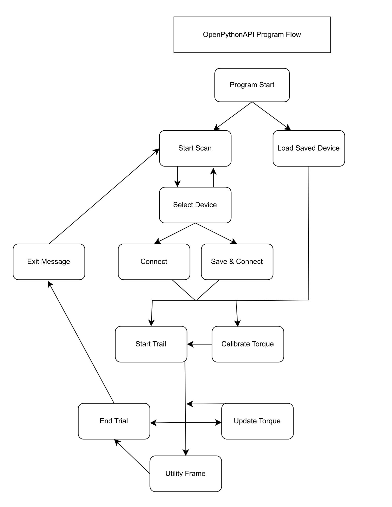

# OpenPythonAPI
## Overview

This program can run on any computer/terminal with python 3.12 installed. Libraries needed can be installed via pip (python's module manager)

Open source Application utilizing the OpenExo API to search, connect to, and controll NAU Biomecatronics Lab's OpenExo systems.

This project uses the MIT License.

The purpose of this project is to provide an open source solution for controlling the OpenExo system that is accessible to anyone and free to modify for their needs.

## Minimum System Requirements
**Operating System:**
* Windows 7 or newer
* macOS 10.9 or newer

**Python Version:**
* Python 3.2 or newer

**Hardware:**
* Processor: Dual-core (e.g., Intel Core i3 or AMD equivalent)
* Memory (RAM): 2 GB minimum (4 GB recommended)
* Storage: 100 MB free space (1 GB recommended for large datasets)
* Display: 768x1024 resolution minimum

## Intallation Guide
Video Guide: https://youtu.be/VnQeUM2K6Vg

BLE (Bluetooth Low Energy) is the heart of this project which provides a connection from this API to the exoskeletons. Bleak, a python library is used to handle all BLE operations. To find out more about Bleak click [here](https://bleak.readthedocs.io/en/latest/).

Other libraries that are required include:
 - `matplotlib`
 - `async_tkinter_loop`
 - `pygame`
 - `async_tkinter_loop`
 - `numpy`
 - `bleak`
 - `pandas`
 - `scikit-learn`
 - `micromlgen`
 - `matplotlib`
 - `pygame`
 - `pillow`

To install all of the libraries run the following command in your terminal from the project directory `python .\install_dependencies.py`

## Greneral WorkFlow
### Program control flow



### Starting the Application
1. Ensure Bluetooth is enabled on your device.

2. Navigate to the project directory in your terminal.

3. Run the command:

`python3 GUI.py`

4. The GUI will launch, presenting various frames for interacting with the system

### Scanning for Devices

1. The application automatically scans for exoskeletons when the scan button is pressed.

2. If Bluetooth is disabled, an OS error will be displayed.

### Navigating the Interface

The GUI consists of several frames, each corresponding to specific functionalities:

* Scan Window: Initiate scanning and connect to devices.

* Active Trial: Monitor active trials and sessions.

* Biofeedback: Access real-time feedback tools.

* Machine Learning: Train and test models for personalized control.

* Update Torque: Change specific attributes of the exoskeleton

### Video Example

https://github.com/user-attachments/assets/6269629e-252b-4e77-b327-0914770ae9e3

## Adding a button

To add a button to the application, follow these steps:

1. Select a Frame: Choose a frame in the PythonApplication\views\ folder where you would like to add the button.

2. Integrate the Button: Here’s an example of how to add a button in a specific frame:

```python
class YourFrame(tk.Frame):
    def __init__(self, parent):
        super().__init__(parent)
        self.create_widgets()

    def create_widgets(self):
        my_button = tk.Button(
            self,
            text="My New Button",
            command=self.my_button_action
        )
        my_button.pack(pady=10)

    def my_button_action(self):
        print("My New Button was clicked!")
```
3. Functionality: Define what the button will do in the my_button_action method.

## Modifying the Graphing

To modify the graphing functionality, you can adjust the BasePlot class and its subclasses. Here's how to do it:

* Limit Points Displayed: In the `update_plot` method, modify the `max_points` variable to control how many points are displayed in the graph:

    ```python
    def update_plot(self, xValues, yValues, secondY, title):
        max_points = -20  # Change this value to display more or fewer points
        xValues = xValues[max_points:]
        yValues = yValues[max_points:]
        secondY = secondY[max_points:]
    ```
* Customize Axes and Titles: In the `update_plot` method, you can also adjust axis labels and titles:

    ```python
    self.ax.set_title(title)
    self.ax.set_xlabel("Time")
    self.ax.set_ylabel("Value")
    ```
* Implement Animation: Each plot subclass (e.g., `TopPlot`, `BottomPlot`) has an animate method that gathers data and updates the plot. Modify this method to change how data is sourced and displayed.

* For graph variable modification, refer to the Biofeedback graph description bellow.

## Adding a New Frame

To add a new frame to the application, follow these steps:

### Step 1: Create the New Frame Class

Create a new Python file in the views folder (e.g., newFeature.py).

Use the following template to define your new frame:

```python
    import tkinter as tk

        class NewFeature(tk.Frame):
        def __init__(self, parent, controller):
            super().__init__(parent)
            self.controller = controller

            label = tk.Label(self, text="New Feature Frame", font=("Arial", 24))
            label.pack(pady=20)

            button = tk.Button(self, text="Go to Scan Window",
                                command=lambda: controller.show_frame("ScanWindow"))
            button.pack(pady=10)
```
### Step 2: Update the ControllerApp Class

Open your main application file.

Import the new frame at the top:

`    from views.newFeature import NewFeature`

Add the new frame to the frames dictionary in the ControllerApp class:
```python
    for F in (ScanWindow, ActiveTrial, UpdateTorque, BioFeedback, MachineLearning, NewFeature):
```
### Step 3: Navigate to the New Frame

You can add a button in any existing frame to navigate to the new feature:
```python
    button = tk.Button(self, text="Go to New Feature",
                    command=lambda: controller.show_frame("NewFeature"))
    button.pack(pady=10)
```
## Biofeedback Frame
### Purpose

The Biofeedback frame provides visual and auditory feedback to users during training or analysis sessions. It aids participants in achieving specific performance goals by leveraging real-time sensor data.

### Signal Used in Biofeedback

1. Biofeedback currently utilizes force-sensitive resistors (FSRs) to monitor plantar pressure or estimated ankle power from exoskeleton sensors, but any sensor can be used.

2. The FSR data signal is accessed via the variable:

    `self.master.controller.deviceManager._realTimeProcessor._chart_data`

3. To switch between left and right leg signals, the variable updates dynamically based on the user’s selection 
    `._chart_data.leftFsr` or `._chart_data.rightFsr`

### Modifying the Signal

To modify the signal used in the biofeedback game:

1. Locate the FSRPlot class in the `chart.py` file.

2. Update the data source to the desired signal by modifying the variable:
    
    `self.master.controller.deviceManager._realTimeProcessor._chart_data` 
    

### Features and Buttons

#### Graphing

1. Graph Display: Visualizes pressure sensor data for real-time monitoring.

2. Target Lines: Displays a goal threshold on the graph when a target value is set.

#### Buttons

1. Back: Returns to the Active Trial frame.

2. Left/Right Leg Toggle: Switches the graph display between left and right leg FSR data.

3. Set Target Value: Opens a dialog box to input a target value for training.

    * Enables tracking progress toward specific performance goals.

4. Reset Target Value: Clears the target value and removes the goal line from the graph.

5. Mark Trial: Marks a specific event during data collection for later analysis.

6. Recalibrate FSRs: Initiates recalibration of the force-sensitive resistors to improve accuracy.

#### Notifications

1. Auditory Feedback: Plays a notification sound (e.g., `notification.wav`) when the user achieves a target.

2. Visual Feedback: The background temporarily changes color to indicate a successful target hit.

### Customization

To add or modify features in the Biofeedback frame, refer to the BioFeedback class in `biofeedback.py`.

